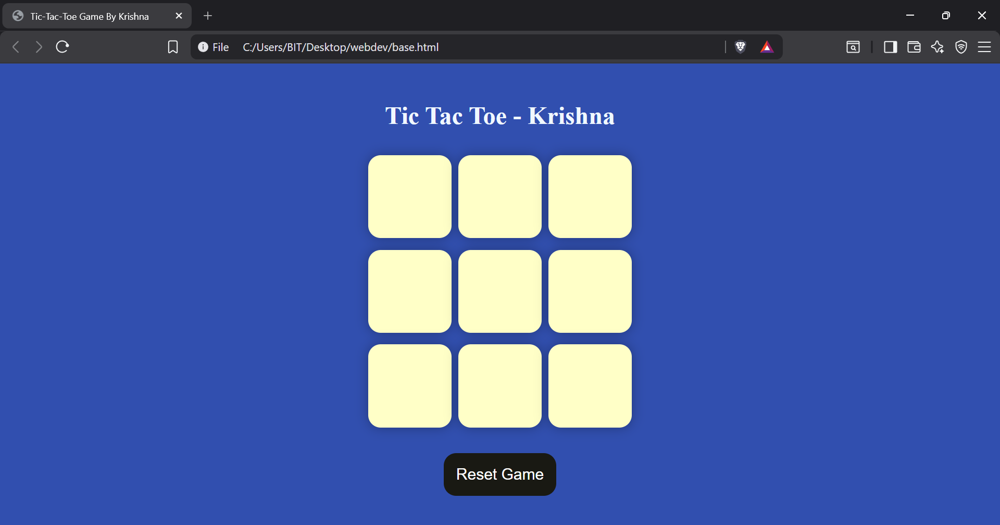
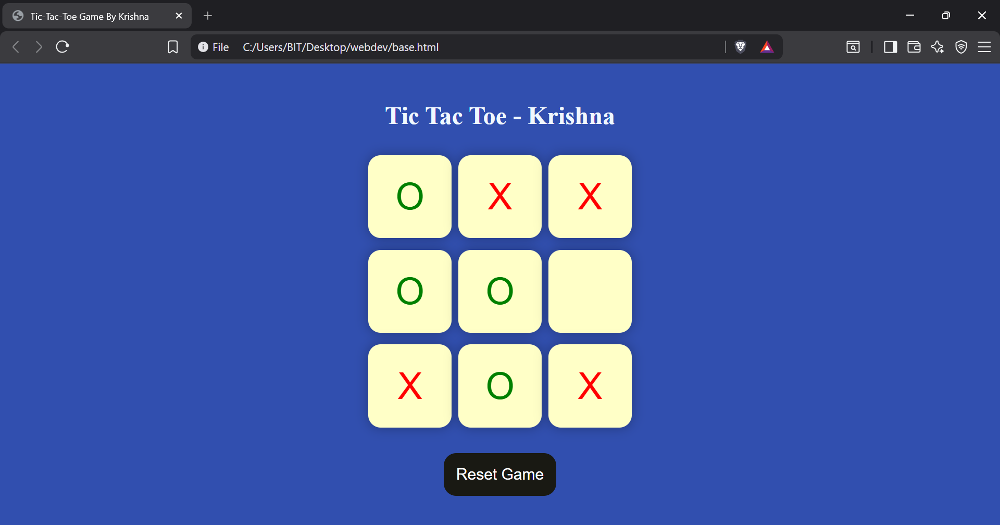
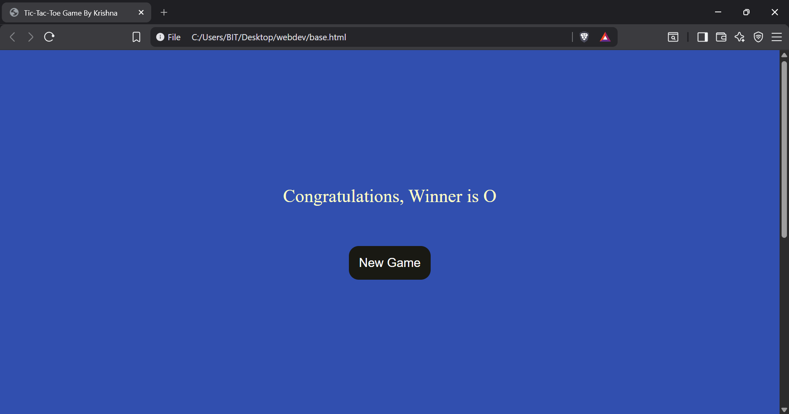

#  Tic Tac Toe Game

A clean and interactive Tic Tac Toe game built using **HTML, CSS, and JavaScript**. This project demonstrates fundamental frontend development concepts including DOM manipulation, event handling, game logic, state management, and responsive UI design.

---

##  Preview

### Home Screen

### Gameplay

### Winner Screen

#### Player Wins

---

##  Features

- Interactive 3×3 Tic Tac Toe board
- Two-player gameplay (X vs O)
- Automatic winner detection
- Winning message display
- Reset Game functionality
- New Game option after match completion
- Prevents overwriting occupied cells
- Clean and responsive user interface
- Smooth gameplay using JavaScript DOM manipulation

---

##  Built With

- HTML5
- CSS3
- JavaScript (ES6)

---

##  Concepts Practiced

- DOM Manipulation
- Event Listeners
- Arrays and Loops
- Conditional Logic
- Functions
- Game State Management
- Responsive Layout
- JavaScript Fundamentals

---

##  Author

**Krishna Verma**

